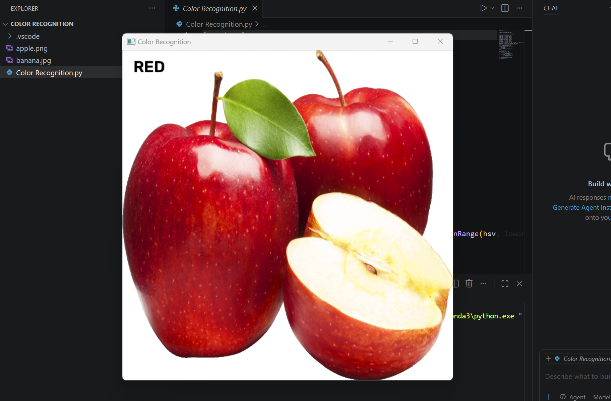
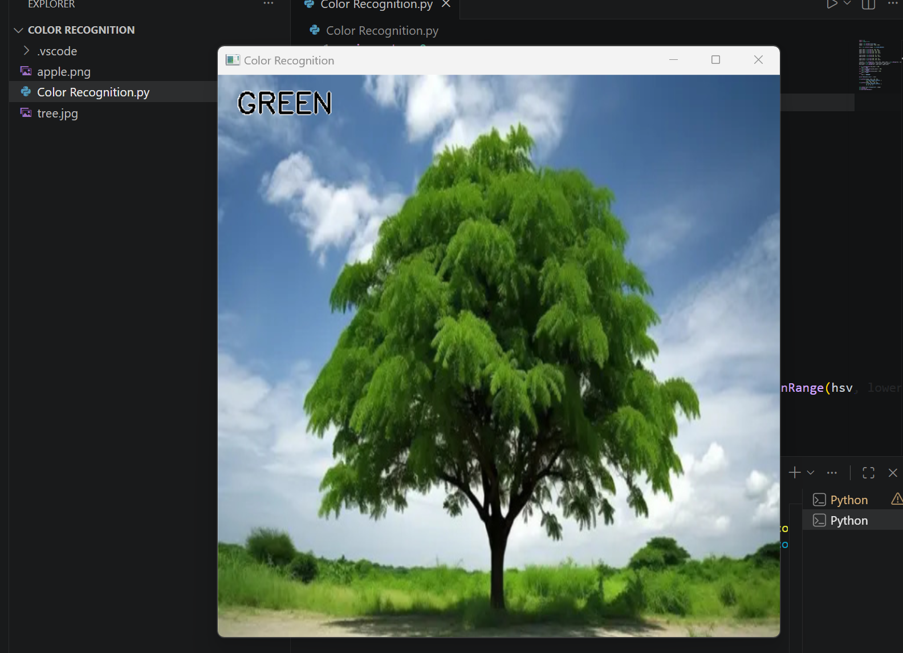

# Color-Recognition-using-OpenCV
# 🎨 Color Recognition using OpenCV

A simple Computer Vision project built with **Python** and **OpenCV** to recognize dominant colors (Red, Green, Blue) in an image using the HSV color space.

---

## Features
- Converts images from BGR to **HSV color space** for accurate color detection.
- Detects **Red**, **Green**, and **Blue** colors based on range masks.
- Displays the recognized color label directly on the image window.

---

## 📸 Results & Output

| Red Color Detection | Green Color Detection |
| :---: | :---: |
|  |  |
